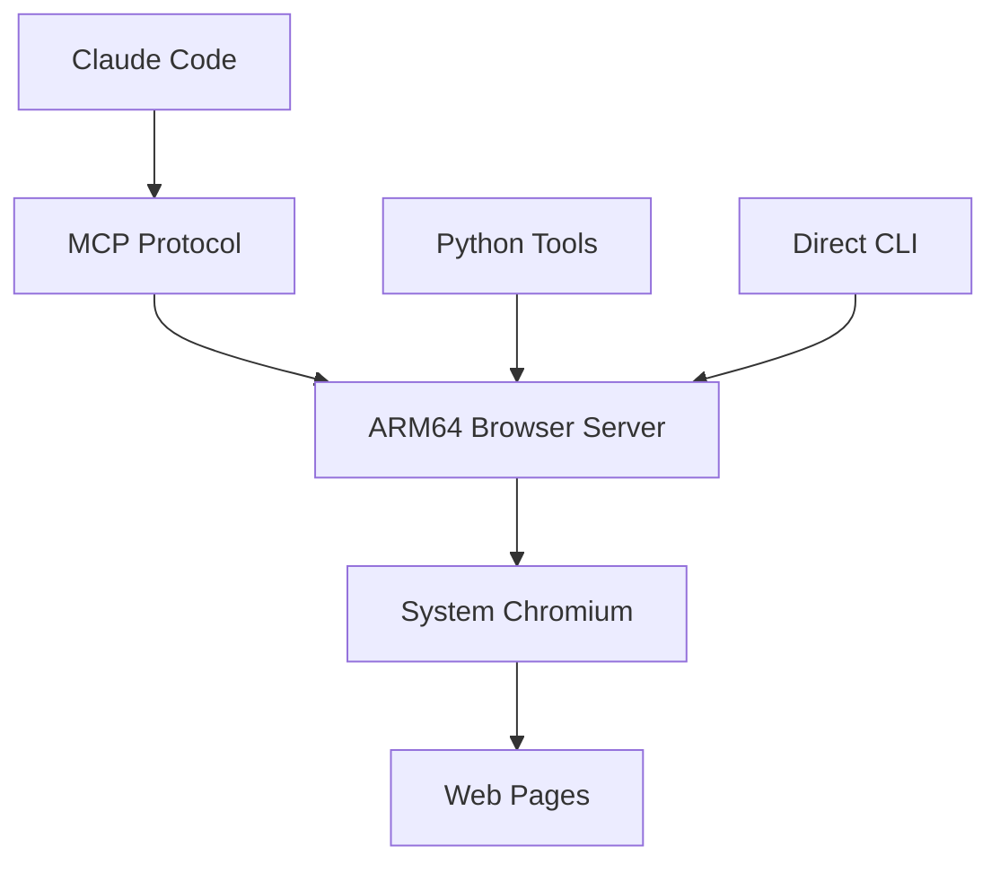

# 🚀 No-Code AI SaaS Builder for Everyone

<p align="center">
  
  
  
  
</p>

<p align="center">
  <strong>Build and test complete SaaS applications with AI assistance on $80 hardware</strong><br>
  <em>Democratizing AI-driven development for the global audience with limited budgets</em>
</p>

---

## 🌍 The Revolution: AI Development for Everyone

**The Old Way**: Enterprise AI development required $50,000+ workstations, excluding 95% of global developers

**The New Way**: A $480 Raspberry Pi setup that gives you the same AI capabilities as Silicon Valley startups

### 🎯 Why This Changes Everything

💸 **Financial Barrier Removed**: What cost $50K now costs $480 (99% reduction)
🌏 **Global Access**: Affordable in every country, not just Silicon Valley
🚀 **No-Code Revolution**: AI builds your SaaS while you focus on customers
🔧 **Complete Automation**: From idea to deployed app without manual coding
⚡ **Instant Testing**: AI tests every feature before your users see it

### 👥 Perfect For the Global Maker Movement

- 🌍 **International Entrepreneurs**: Access Silicon Valley AI tools on local budgets
- 🎓 **Students & Educators**: Learn modern AI development without debt
- 🏠 **Side Hustlers**: Build SaaS products while keeping your day job
- 🌱 **Solo Founders**: Complete development team in a $80 device
- 🤝 **Small Teams**: Compete with venture-funded startups
- 🌐 **Remote Communities**: AI development anywhere with internet

## 🚀 What You Can Build (No Coding Required!)

### AI-Driven SaaS Ideas That Actually Work

**🏪 E-commerce Tools**
- Price monitoring across thousands of competitors
- Product research and market analysis
- Automated inventory tracking
- Customer sentiment analysis from reviews

**📊 Business Intelligence**
- Social media monitoring dashboards
- SEO rank tracking services
- Lead generation and qualification
- Competitor analysis platforms

**🤖 Automation Services**
- Website uptime monitoring
- Content verification and compliance
- Data entry and processing
- Form filling and submission services

**🎯 Marketing Solutions**
- A/B testing platforms
- Landing page optimization
- Email campaign monitoring
- Social proof collection

### 💡 The Magic: AI Does the Heavy Lifting

1. **🗣️ Describe Your Idea**: "I want to monitor competitor prices"
2. **🤖 AI Writes the Code**: Claude builds the scraping logic
3. **🧪 AI Tests Everything**: Automated browser testing ensures it works
4. **🚀 Deploy & Scale**: Your SaaS is ready for customers
5. **💰 Profit**: Focus on marketing while AI maintains the product

---

## ✨ What Makes This Special

**🎯 No-Code SaaS Development**
- Describe your app idea in plain English
- AI writes, tests, and deploys your application
- Focus on customers, not coding
- Launch in days, not months

**💰 Massive Cost Reduction**
- $480 vs $50,000+ for traditional AI development
- Same capabilities as Silicon Valley startups
- No recurring cloud bills or licensing fees
- Own your development infrastructure

**🌍 Global Accessibility**
- Works anywhere with internet connection
- Affordable in every country and currency
- No technical background required
- Complete tutorials and examples included

**⚡ Instant Results**
- See your SaaS working in real-time
- AI tests every feature automatically
- No debugging or technical troubleshooting
- Deploy to customers the same day

## 🚀 Quick Start

### 📚 Complete Beginner Guide
**Never set up a Raspberry Pi before?** 
👉 **[COMPLETE SETUP GUIDE](docs/COMPLETE-SETUP-GUIDE.md)** - Step-by-step from zero to SaaS builder in 30 minutes!

### Prerequisites
```bash
# Install system dependencies
sudo apt update
sudo apt install chromium-browser nodejs npm python3

# Verify Chromium works
chromium-browser --version
```

### Installation
```bash
git clone https://github.com/nfodor/claude-arm64-browser
cd claude-arm64-browser
npm install
chmod +x *.py *.sh
```

### ⚡ Quick Test (One-Liner)
```bash
# Verify it works immediately after install:
python3 -c "import sys; sys.path.append('.'); import arm64_browser; print('✅ ARM64 Browser Works!' if 'error' not in arm64_browser.navigate('https://example.com').lower() else '❌ Failed')"
```
**Expected Result:** `✅ ARM64 Browser Works!`

### 🎬 Run the Kick-Ass Demo
```bash
# Quick demo with immediate visible results (30 seconds)
python3 instant_demo.py

# Or comprehensive demo showing all capabilities (2-3 minutes)
./run_demo.sh
```

### Test the Setup
```bash
# Test MCP server directly
echo '{"jsonrpc":"2.0","method":"tools/list","id":1}' | node index.js

# Test Python wrapper
python3 simple_browser.py
```

## 🎯 Claude CLI Integration

### Prerequisites
```bash
# Install Claude CLI if you haven't already
npm install -g @anthropic/claude-cli
```

### Add to Claude CLI
```bash
# From the project directory after cloning
claude mcp add chromium-arm64 "$(pwd)/mcp-wrapper.sh" --scope user
```

### Verify Connection
```bash
claude mcp list
# Should show: chromium-arm64: /path/to/mcp-wrapper.sh - ✓ Connected
```

### ⚠️ Important: Restart Claude After Adding
**You MUST start a new Claude session after adding the MCP server:**
```bash
# Exit current session if in one
exit
# Start fresh session
claude
```

### Using in Claude CLI

**Ask Claude to use the chromium-arm64 tools:**
```
List available MCP servers and use chromium-arm64 to navigate to https://example.com

Take a screenshot using the chromium-arm64 tool

Use chromium-arm64 to click the button with selector #submit

Fill the email field using chromium-arm64 with test@example.com
```

**Be explicit to avoid Playwright/Puppeteer:**
- ✅ "Use chromium-arm64 to navigate..."
- ✅ "Using the chromium-arm64 tool, take a screenshot"
- ❌ "Open a browser" (might try broken Playwright)
- ❌ "Take a screenshot" (might try broken Puppeteer)

### 🎉 Success Example

When working correctly, you'll see:
```
You: Use chromium-arm64 to navigate to https://httpbin.org/json and show me what you see

Claude: I'll navigate to https://httpbin.org/json using the chromium-arm64 tool.

[Uses chromium-arm64.navigate tool]

The page displays a JSON object with a slideshow structure containing:
- Author: "Yours Truly"
- Date: "date of publication"
- Title: "Sample Slide Show"
...
```

## 📚 Usage Examples

### Python API
```python
import simple_browser

# Navigate to any website
result = simple_browser.browser_navigate("https://example.com")
print(result)  # "Successfully navigated to https://example.com"

# Take a screenshot
screenshot = simple_browser.browser_screenshot("homepage.png")
print(screenshot)  # "Screenshot saved to /tmp/homepage.png"

# Execute JavaScript
title = simple_browser.browser_evaluate("document.title")
print(title)  # Website title

# Extract page content
content = simple_browser.browser_get_content("text")
print(content[:100])  # First 100 chars of page text
```

### MCP Tools (via Claude Code)
Once configured, use these tools directly in Claude Code:
- `navigate` - Go to URLs
- `screenshot` - Capture page images
- `click` - Click elements by CSS selector
- `fill` - Fill form fields
- `evaluate` - Execute JavaScript
- `get_content` - Extract page HTML/text
- `close_browser` - Clean shutdown

## 🎯 Real-World Use Cases

### 1. **End-to-End SaaS Testing (The Game Changer)**
```python
# Complete user journey testing - NO HUMAN DEBUGGING NEEDED
def test_saas_signup_flow():
    # Navigate to signup page
    simple_browser.browser_navigate("https://yourapp.com/signup")
    
    # Fill registration form
    simple_browser.browser_fill("#email", "test@example.com")
    simple_browser.browser_fill("#password", "securepass123")
    simple_browser.browser_click("#signup-btn")
    
    # Verify successful signup
    success_msg = simple_browser.browser_evaluate("document.querySelector('.success-message').textContent")
    
    # Test dashboard access
    simple_browser.browser_navigate("https://yourapp.com/dashboard")
    dashboard_loaded = simple_browser.browser_evaluate("document.querySelector('.dashboard').style.display !== 'none'")
    
    # Take screenshot for visual regression
    simple_browser.browser_screenshot("dashboard_post_signup.png")
    
    return "PASS" if success_msg and dashboard_loaded else "FAIL"
```

### 2. **Autonomous API + Frontend Testing**
```python
# Backend API validation through frontend
def validate_api_through_ui():
    # Test data creation via UI
    simple_browser.browser_navigate("https://yourapp.com/create-project")
    simple_browser.browser_fill("#project-name", "Test Project AI")
    simple_browser.browser_click("#create-btn")
    
    # Verify data appears in list view
    simple_browser.browser_navigate("https://yourapp.com/projects")
    project_exists = simple_browser.browser_evaluate("document.querySelector('[data-project=\"Test Project AI\"]') !== null")
    
    # Test data modification
    simple_browser.browser_click("[data-project=\"Test Project AI\"] .edit-btn")
    simple_browser.browser_fill("#project-name", "Modified by AI")
    simple_browser.browser_click("#save-btn")
    
    # Verify backend persistence
    simple_browser.browser_navigate("https://yourapp.com/projects")
    updated = simple_browser.browser_evaluate("document.querySelector('[data-project=\"Modified by AI\"]') !== null")
    
    return {"api_create": project_exists, "api_update": updated}
```

### 3. **Cross-Browser Compatibility (Zero Human Intervention)**
```python
# Automated cross-platform testing
def test_responsive_design():
    test_results = {}
    
    # Mobile viewport
    simple_browser.browser_evaluate("window.resizeTo(375, 667)")  # iPhone size
    simple_browser.browser_navigate("https://yourapp.com")
    simple_browser.browser_screenshot("mobile_view.png")
    mobile_nav = simple_browser.browser_evaluate("document.querySelector('.mobile-nav').style.display !== 'none'")
    
    # Desktop viewport  
    simple_browser.browser_evaluate("window.resizeTo(1920, 1080)")
    simple_browser.browser_screenshot("desktop_view.png")
    desktop_nav = simple_browser.browser_evaluate("document.querySelector('.desktop-nav').style.display !== 'none'")
    
    return {"mobile_responsive": mobile_nav, "desktop_responsive": desktop_nav}
```

### 4. **Competitive Analysis Automation**
```python
# Monitor competitor pricing
simple_browser.browser_navigate("https://competitor.com/pricing")
simple_browser.browser_screenshot("competitor_pricing.png")
prices = simple_browser.browser_evaluate("document.querySelectorAll('.price').length")
```

### 5. **SEO Monitoring**
```python
# Check search rankings
simple_browser.browser_navigate("https://google.com/search?q=your+keywords")
simple_browser.browser_screenshot("serp_results.png")
rankings = simple_browser.browser_evaluate("document.querySelector('.g').textContent")
```

## 💡 Why ARM64 + Browser Automation = SaaS Gold

### The Critical Gap in SaaS Development
**Every SaaS startup MUST ensure their application works end-to-end before shipping.** Traditional approaches fail because:

- **❌ Manual Testing**: Expensive, slow, error-prone, doesn't scale
- **❌ x86_64 Only Tools**: Puppeteer/Playwright fail on ARM64 with broken binaries
- **❌ Human Debugging**: QA teams spend days debugging test failures
- **❌ Limited Coverage**: Can't test every user journey without massive teams
- **❌ Regression Blind Spots**: Changes break existing features without detection

### Our Breakthrough: Autonomous AI Testing on ARM64
- ✅ **Zero Human Debugging**: AI agents test complete user flows autonomously
- ✅ **24/7 Continuous Testing**: Always-on validation on budget hardware  
- ✅ **Full Stack Coverage**: Frontend + Backend + API validation through real browser
- ✅ **Visual Regression Detection**: Screenshots catch UI breaking changes automatically
- ✅ **Cross-Device Testing**: Mobile/tablet/desktop viewport automation
- ✅ **Native ARM64**: Uses system Chromium instead of broken x86_64 binaries
- ✅ **Cost Effective**: $480 setup vs $50K+ traditional QA infrastructure

### Why This Changes SaaS Development Forever

**Before**: Manual QA teams → Expensive → Slow → Human errors → Limited coverage
```
Deploy → Hope → Customer finds bugs → Emergency fixes → Reputation damage
```

**After**: AI agents → Autonomous → Fast → Comprehensive → 24/7 monitoring
```
Code → AI tests everything → Deploy with confidence → Happy customers
```

### The ARM64 Advantage
Standard browser automation fails on ARM64 because Puppeteer/Playwright download x86_64 binaries that don't run. Our solution:
- Uses system-installed Chromium (native ARM64)
- Proper launch flags for headless ARM64 operation  
- MCP protocol compliance for Claude Code integration
- Zero dependency on pre-built browser binaries

## 📊 Architecture



## 🛠️ Technical Details

### System Requirements
- **OS**: Raspberry Pi OS (64-bit) or any ARM64 Linux
- **RAM**: 4GB minimum, 8GB recommended
- **Storage**: 32GB+ fast SD card (Class 10/A2)
- **Browser**: Chromium (installed via apt)
- **Runtime**: Node.js 18+, Python 3.8+

### Browser Configuration
```javascript
// Optimized for ARM64
{
  executablePath: '/usr/bin/chromium-browser',
  headless: true,
  args: [
    '--no-sandbox',
    '--disable-setuid-sandbox', 
    '--disable-dev-shm-usage',
    '--disable-gpu',
    '--disable-web-security',
    '--disable-features=VizDisplayCompositor'
  ]
}
```

## 🐛 Troubleshooting

### MCP Connection Issues

**chromium-arm64 shows "✗ Failed to connect"**
```bash
# Check if the wrapper script exists and is executable
ls -la $(pwd)/mcp-wrapper.sh
chmod +x mcp-wrapper.sh

# Test the server directly
echo '{"jsonrpc":"2.0","method":"tools/list","id":1}' | node index.js

# Re-add with correct path
claude mcp remove chromium-arm64
claude mcp add chromium-arm64 "$(pwd)/mcp-wrapper.sh" --scope user

# IMPORTANT: Restart Claude
exit
claude
```

**Claude tries to use Playwright/Puppeteer instead**
- Be explicit: Always mention "chromium-arm64" in your prompts
- Check available servers: `claude mcp list`
- If chromium-arm64 isn't listed, restart Claude

**"Server not found" in Claude session**
- MCP servers are loaded at startup
- Always restart Claude after adding/modifying MCP servers
- Run `claude mcp list` to verify before starting

### Common Issues

**Browser won't start**
```bash
# Check Chromium installation
which chromium-browser
chromium-browser --version

# Test headless mode
chromium-browser --headless --disable-gpu --dump-dom https://example.com
```

**MCP connection fails**
```bash
# Verify Claude Code MCP setup
claude mcp list

# Test server manually
echo '{"jsonrpc":"2.0","method":"tools/list","id":1}' | node index.js
```

**Memory issues**
```bash
# Monitor system resources
htop

# Optimize Chromium memory usage
# Add to browser args: '--memory-pressure-off', '--max_old_space_size=512'
```

## 💰 Complete Startup AI Setup - Under $500

Build a complete AI-powered development environment for less than a high-end graphics card:

| Component | Purpose | Cost¹ |
|-----------|---------|--------|
| **Raspberry Pi 5 16GB** | Main compute unit | $180 |
| **Official Pi Display 2** | Touch interface | $120 |
| **Official Pi Power Supply** | Reliable 27W power | $25 |
| **SanDisk Extreme 128GB A2** | Fast storage | $35 |
| **Claude Code Pro (2 months)** | AI development platform | $80 |
| **Case + Cables** | Protection & connectivity | $40 |
| **Total** | **Complete AI Workstation** | **$480** |

### What You Get:
- 🖥️ **Portable AI Workstation**: Desktop-class performance in a 4"×3" footprint
- 🧠 **Claude Sonnet 4 Access**: Latest AI model with 200K context window
- 🌐 **Browser Automation**: Web scraping, testing, monitoring capabilities
- 🔄 **24/7 Operation**: Always-on AI assistant and automation
- ⚡ **Low Power**: 15W total system power (vs 500W+ traditional setup)
- 🏠 **Silent Operation**: No fans, completely quiet
- 📱 **Touch Interface**: Direct interaction with built-in display

### ROI for Startups:
- **🧪 Autonomous Testing**: AI agents test entire SaaS flows without human debugging - saves 40+ hours/week
- **🔄 Continuous Validation**: 24/7 monitoring ensures your app works before customers find bugs
- **💰 QA Cost Savings**: Replace expensive manual testing teams with automated AI validation
- **🚀 Faster Shipping**: Deploy with confidence knowing AI has tested all user journeys
- **🎯 Zero Regression**: Automated visual and functional testing prevents breaking changes
- **📊 Market Research**: Automated competitor analysis saves 20+ hours/week
- **🤖 Customer Support**: AI-powered response generation and testing
- **📝 Content Creation**: Automated social media monitoring and content ideas
- **⚡ Product Development**: AI-assisted coding and rapid prototyping

---

## 🤝 Contributing

We welcome contributions! This project democratizes AI access for startups and makers.

### Areas for Contribution:
- 📱 Mobile browser support (Android/iOS testing)
- 🔧 Additional MCP tools and integrations  
- 📊 Performance optimizations for Pi Zero/smaller devices
- 🎨 UI/UX improvements for touch interface
- 📚 Tutorial content and use-case examples

### Development Setup:
```bash
git clone https://github.com/nfodor/claude-arm64-browser
cd claude-arm64-browser
npm install
# No development server needed - ready to use!
```

## 📄 License

MIT License - feel free to use in commercial projects!

## 🙏 Acknowledgments

- **Anthropic** for Claude Code and MCP protocol
- **Raspberry Pi Foundation** for democratizing computing
- **Chromium Project** for ARM64 browser support
- **Open Source Community** for making this possible

---

## 📞 Support & Community

- 🐛 **Issues**: [GitHub Issues](https://github.com/nfodor/claude-arm64-browser/issues)
- 💬 **Discussions**: [GitHub Discussions](https://github.com/nfodor/claude-arm64-browser/discussions)
- 📧 **Email**: github@fodor.app
- 🌐 **Repository**: [github.com/nfodor/claude-arm64-browser](https://github.com/nfodor/claude-arm64-browser)

---

<p align="center">
  <strong>⭐ Star this repo if it helps your startup leverage AI on a budget!</strong><br>
  <em>Every star helps more developers discover affordable AI solutions</em>
</p>

---

### Footnotes

¹ **Pricing as of 2025** (USD, approximate):
- **Raspberry Pi 5 16GB**: $180 (official MSRP)
- **Pi Display 2 (11.9" Touch)**: $120 (official accessory)
- **Official 27W USB-C PSU**: $25 (recommended for Pi 5)
- **SanDisk Extreme 128GB A2**: $35 (high-speed micro SD)
- **Claude Code Pro**: $40/month (2-month startup period)
- **Case & Cables**: $40 (official case + HDMI/USB accessories)

*Prices may vary by region and availability. Check official retailers for current pricing.*

---

<p align="center">
  <sub>Built with ❤️ for the maker and startup community</sub>
</p>