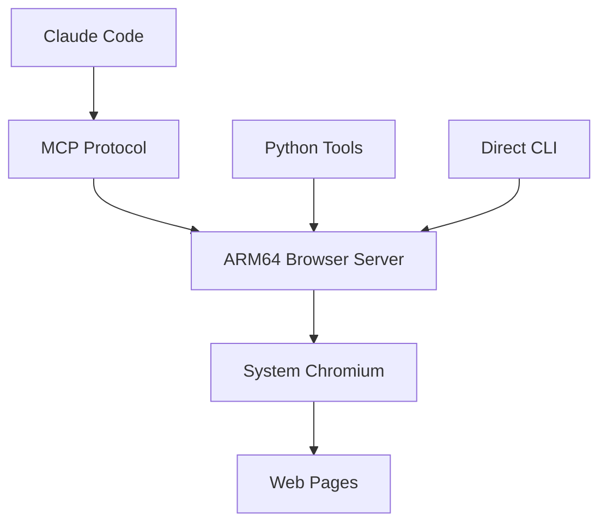

# MCP Chromium ARM64 Server

<p align="center">
  
  
  
  
</p>

<p align="center">
  <strong>Cross-platform ARM64 browser automation via Chrome DevTools Protocol</strong><br>
  <em>Native Chromium control with 22 MCP tools for Linux, macOS, and Windows ARM64</em>
</p>

## 🚀 Two Implementation Approaches Available

### 📦 Version Comparison

| Feature | **Direct CDP (v1.3.0)** ⭐ **RECOMMENDED** | **Puppeteer-based (v1.2.0)** |
|---------|---------------------------------------------|------------------------------|
| **Dependencies** | Only `ws` + MCP SDK (89 packages) | Puppeteer + MCP SDK (163 packages) |
| **Memory Usage** | Lower (native chromium) | Higher (Node.js wrapper overhead) |
| **Startup Time** | Faster (direct WebSocket) | Slower (puppeteer initialization) |
| **Browser Control** | Native Chrome DevTools Protocol | Puppeteer abstraction layer |
| **ARM64 Optimization** | Full native ARM64 | Depends on Puppeteer ARM64 support |
| **Debugging** | Raw CDP messages visible | Abstracted by Puppeteer |
| **Maintenance** | Chrome protocol changes only | Puppeteer + Chrome protocol changes |
| **Performance** | Best (direct communication) | Good (wrapped communication) |

### 🎯 When to Use Which Version

**Use Direct CDP (v1.3.0) if:**
- ✅ You want maximum performance and minimum dependencies
- ✅ You need native ARM64 optimization
- ✅ You want direct Chrome DevTools Protocol control
- ✅ You're building production automation systems
- ✅ You want the latest features and fastest updates

**Use Puppeteer-based (v1.2.0) if:**
- ✅ You're migrating from existing Puppeteer code
- ✅ You prefer the Puppeteer API abstraction
- ✅ You need specific Puppeteer features not yet implemented in direct CDP
- ✅ You want to minimize changes to existing workflows

### 🔄 Switching Between Versions

```bash
# Switch to Direct CDP (recommended)
git checkout direct-chromium
npm install  # Only 89 packages

# Switch back to Puppeteer version
git checkout main  
npm install  # 163 packages
```

---

## 📚 Documentation & Specialized Guides

This repository includes multiple documentation approaches for different audiences:

### 🎯 **For Developers & DevOps Engineers**
**[📖 TECHNICAL README](README-TECHNICAL.md)** - Comprehensive technical documentation including:
- Architecture diagrams and API reference
- Performance benchmarks and optimization guides
- CI/CD integration examples and E2E testing workflows
- Advanced debugging and customization options

### 🍓 **For Makers & Entrepreneurs** 
**[📖 RASPBERRY PI README](README-RASPBERRY-PI.md)** - Budget-focused guide featuring:
- Complete $480 AI development setup
- No-code SaaS development workflows
- Real-world startup use cases and ROI analysis
- Global accessibility and maker movement focus

### ⚡ **Quick Links**
- **Developers**: Jump to [Technical Documentation →](README-TECHNICAL.md)
- **Makers**: Jump to [Raspberry Pi Guide →](README-RASPBERRY-PI.md)
- **Everyone**: Continue reading for universal setup and usage

---

## ✨ Core Features

**🤖 Native ARM64 Browser Automation** 
- Direct Chrome DevTools Protocol implementation
- 22 comprehensive MCP tools for complete browser control
- Optimized for Raspberry Pi and Apple Silicon architectures
- No dependency on broken x86_64 Puppeteer binaries

**⚡ High Performance Architecture**
- Only 2 dependencies (ws + MCP SDK) vs 163 packages in Puppeteer
- Lower memory usage and faster startup times
- Direct WebSocket communication with Chrome
- Comprehensive logging and audit capabilities

**🛠️ Enterprise-Ready Development**
- Full debugging suite with console/network monitoring  
- Accessibility, SEO, and performance audits built-in
- CI/CD integration examples and E2E testing workflows
- Cross-platform compatibility (Linux ARM64, macOS Apple Silicon)

**💰 Affordable Innovation Platform**
- Complete AI development setup for under $500
- Same capabilities as $50K+ enterprise workstations  
- Global accessibility for makers and startups worldwide
- No recurring cloud costs - own your infrastructure

---

## 🚀 Universal Quick Start

### Prerequisites
```bash
# Install system dependencies
sudo apt update
sudo apt install chromium-browser nodejs npm python3

# Verify Chromium works
chromium-browser --version
```

### Installation
```bash
git clone https://github.com/nfodor/mcp-chromium-arm64
cd mcp-chromium-arm64
npm install
chmod +x *.py *.sh
```

### Quick Test (One-Liner)
```bash
# Verify it works immediately after install:
python3 -c "import sys; sys.path.append('.'); import arm64_browser; print('[OK] ARM64 Browser Works!' if 'error' not in arm64_browser.navigate('https://example.com').lower() else '[FAIL] Failed')"
```
**Expected Result:** `[OK] ARM64 Browser Works!`

### Test & Demo
```bash
# Quick demo with immediate visible results (30 seconds)
python3 instant_demo.py

# Or comprehensive demo showing all capabilities (2-3 minutes)
./run_demo.sh
```

### Test the Setup
```bash
# Test MCP server directly
echo '{"jsonrpc":"2.0","method":"tools/list","id":1}' | node index.js

# Test Python wrapper
python3 simple_browser.py
```

---

## 🛠️ Developer Guide & Debugging

### 🔧 Available MCP Tools (22 total)

#### Core Browser Control
- `navigate` - Navigate to URLs with full page loading
- `screenshot` - Capture PNG screenshots (full page or viewport)
- `click` - Click elements by CSS selector with precise positioning
- `fill` - Fill input fields with text or values
- `hover` - Hover over elements for dropdown/tooltip interactions
- `select` - Select dropdown options by value
- `evaluate` - Execute JavaScript and return results
- `get_content` - Extract page HTML or plain text content

#### Advanced Functionality  
- `get_console_logs` - Retrieve browser console output
- `get_console_errors` - Get console error messages only
- `get_network_logs` - Monitor all network requests/responses
- `get_network_errors` - Track failed network requests (4xx/5xx)
- `wipe_logs` - Clear all stored logs from memory
- `get_selected_element` - Get info about currently focused element

#### Audit & Analysis Tools
- `run_accessibility_audit` - Check alt text, labels, headings, contrast
- `run_performance_audit` - Measure load times, memory usage, resources
- `run_seo_audit` - Validate title, meta description, H1 tags, canonical
- `run_best_practices_audit` - Check HTTPS, deprecated HTML, viewport
- `run_nextjs_audit` - Next.js specific optimization checks
- `run_debugger_mode` - Comprehensive debugging information
- `run_audit_mode` - Run all audits together with summary
- `close_browser` - Clean shutdown of chromium process

### 🐛 Debugging & Development

#### Direct MCP Testing
```bash
# Test individual tools directly
echo '{"jsonrpc":"2.0","id":1,"method":"tools/call","params":{"name":"navigate","arguments":{"url":"https://example.com"}}}' | node index.js

echo '{"jsonrpc":"2.0","id":2,"method":"tools/call","params":{"name":"evaluate","arguments":{"script":"document.title"}}}' | node index.js

echo '{"jsonrpc":"2.0","id":3,"method":"tools/call","params":{"name":"screenshot","arguments":{"name":"debug.png"}}}' | node index.js
```

#### Chrome DevTools Protocol Debugging
```bash
# Manual CDP connection test
node -e "
const { WebSocket } = require('ws');
const { spawn } = require('child_process');

const chrome = spawn('/usr/bin/chromium-browser', [
  '--headless', '--remote-debugging-port=9227'
]);

setTimeout(() => {
  fetch('http://localhost:9227/json')
    .then(r => r.json())
    .then(tabs => {
      console.log('Available tabs:', tabs.length);
      const ws = new WebSocket(tabs[0].webSocketDebuggerUrl);
      ws.on('open', () => {
        console.log('CDP WebSocket connected!');
        ws.send(JSON.stringify({id: 1, method: 'Runtime.evaluate', params: {expression: '2+2'}}));
      });
      ws.on('message', (data) => {
        console.log('CDP Response:', JSON.parse(data));
        chrome.kill();
        process.exit(0);
      });
    });
}, 2000);
"
```

#### Performance Monitoring
```bash
# Monitor system resources during operation
htop &
echo '{"jsonrpc":"2.0","id":1,"method":"tools/call","params":{"name":"navigate","arguments":{"url":"https://httpbin.org/delay/5"}}}' | time node index.js

# Check memory usage
ps aux | grep chromium
free -h
```

#### Network Debugging
```bash
# Check if debugging port is accessible
curl -s http://localhost:9222/json | jq '.[] | {id, title, type}'

# Monitor WebSocket traffic (install websocat)
websocat ws://localhost:9222/devtools/page/[TAB_ID] --text -v
```

### 🔍 Common Debugging Scenarios

#### 1. WebSocket Connection Issues
```bash
# Symptoms: "CDP command timeout" errors
# Check if chrome debugging port is running
lsof -i :9222

# Test manual connection
node -e "
const { WebSocket } = require('ws');
const ws = new WebSocket('ws://localhost:9222/devtools/browser');
ws.on('open', () => console.log('✓ WebSocket OK'));
ws.on('error', (e) => console.log('✗ WebSocket Error:', e.message));
setTimeout(() => process.exit(0), 2000);
"
```

#### 2. Chrome Process Issues  
```bash
# Symptoms: Browser won't start or hangs
# Kill any stuck processes
pkill -f chromium-browser
pkill -f remote-debugging-port

# Test chrome startup manually
timeout 10s /usr/bin/chromium-browser --headless --remote-debugging-port=9223 --no-sandbox

# Check chrome logs
journalctl --user -u chromium --since "1 hour ago"
```

#### 3. Element Selection Problems
```bash
# Debug CSS selectors interactively
echo '{"jsonrpc":"2.0","id":1,"method":"tools/call","params":{"name":"evaluate","arguments":{"script":"document.querySelectorAll(\"button\").length"}}}' | node index.js

# Get element information
echo '{"jsonrpc":"2.0","id":1,"method":"tools/call","params":{"name":"evaluate","arguments":{"script":"document.querySelector(\"#mybutton\") ? \"found\" : \"not found\""}}}' | node index.js
```

#### 4. Memory and Performance Issues
```bash
# Monitor memory during operation
watch -n 1 'ps aux | grep -E "(chromium|node)" | grep -v grep'

# Chrome memory debugging
echo '{"jsonrpc":"2.0","id":1,"method":"tools/call","params":{"name":"evaluate","arguments":{"script":"JSON.stringify(performance.memory)"}}}' | node index.js
```

### 🎯 Advanced Debugging Features

#### Enable Verbose Logging
```bash
# Set environment variables for detailed output
export DEBUG=puppeteer:*
export NODE_ENV=development

# Run with detailed Chrome logs
/usr/bin/chromium-browser --headless --enable-logging --log-level=0 --remote-debugging-port=9222
```

#### CDP Message Tracing
```bash
# Create debug version with message logging
cp index.js debug-index.js

# Add to sendCDPCommand method:
# console.log('→ CDP:', JSON.stringify(command));
# console.log('← CDP:', JSON.stringify(response));

node debug-index.js
```

#### Integration with Browser DevTools
```bash
# Connect regular Chrome DevTools to the headless instance
# 1. Start the MCP server
# 2. Open regular Chrome/Chromium
# 3. Navigate to: chrome://inspect
# 4. Click "Configure..." and add localhost:9222
# 5. Click "inspect" on the page you want to debug
```

### 📊 Performance Benchmarks

#### Startup Time Comparison
```bash
# Direct CDP (v1.3.0)
time echo '{"jsonrpc":"2.0","id":1,"method":"tools/call","params":{"name":"evaluate","arguments":{"script":"Date.now()"}}}' | node index.js

# Puppeteer version (v1.2.0)  
git checkout main
time echo '{"jsonrpc":"2.0","id":1,"method":"tools/call","params":{"name":"evaluate","arguments":{"script":"Date.now()"}}}' | node index.js
```

#### Memory Usage Monitoring
```bash
# Before operation
free -h && ps aux | grep -E "(chromium|node)" | grep -v grep

# During operation (run in another terminal)
watch -n 1 'echo "=== $(date) ===" && free -h && echo && ps aux | grep -E "(chromium|node)" | grep -v grep'
```

### 🚨 Error Codes & Solutions

| Error | Cause | Solution |
|-------|-------|----------|
| `CDP command timeout` | WebSocket connection lost | Restart browser, check port availability |
| `WebSocket not ready` | Chrome not fully started | Increase startup delay, check chrome process |
| `Element not found` | CSS selector invalid | Verify selector with `evaluate` tool |
| `ECONNREFUSED` | Debugging port blocked | Check firewall, kill existing chrome processes |
| `Navigation timeout` | Page loading issues | Check network, increase timeout, try simpler page |

### 🔧 Customization & Extension

#### Adding New MCP Tools
```javascript
// In index.js, add to tools array:
{
  name: 'my_custom_tool',
  description: 'My custom functionality',
  inputSchema: {
    type: 'object',
    properties: {
      param: { type: 'string', description: 'Parameter description' }
    },
    required: ['param']
  }
}

// Add to switch statement in CallToolRequestSchema handler:
case 'my_custom_tool':
  return await this.myCustomTool(args.param);

// Implement the method:
async myCustomTool(param) {
  await this.ensureChromium();
  const result = await this.sendCDPCommand('Page.navigate', { url: param });
  return { content: [{ type: 'text', text: `Custom result: ${result}` }] };
}
```

#### Chrome Launch Options
```javascript
// Modify in startChromium() method:
const customArgs = [
  '--headless',
  '--no-sandbox',
  '--disable-extensions',
  '--disable-plugins',
  '--disable-background-timer-throttling',
  '--disable-backgrounding-occluded-windows',
  '--disable-renderer-backgrounding',
  '--remote-debugging-port=9222',
  '--window-size=1920,1080',        // Custom viewport
  '--user-agent=CustomUA/1.0',      // Custom user agent
  '--disable-web-security',         // For CORS testing
  '--allow-running-insecure-content' // For mixed content
];
```

---

## 🌐 Cross-Platform ARM64 Compatibility

### **Platform Support Matrix**

| Platform | Status | Chrome Path | Installation Method | Notes |
|----------|--------|-------------|---------------------|--------|
| **Linux ARM64** ✅ | **Fully Supported** | `/usr/bin/chromium-browser` | `apt install chromium-browser` | Tested on Raspberry Pi OS |
| **macOS Apple Silicon** ⚠️ | **Requires Modifications** | `/Applications/Google Chrome.app/Contents/MacOS/Google Chrome` | Download from Google or `brew install chromium` | Need path and flag updates |
| **Windows ARM64** ❓ | **Untested** | `C:\Program Files\Google\Chrome\Application\chrome.exe` | Download from Google | Would need Windows-specific changes |

### **macOS Apple Silicon Setup**

#### **Prerequisites**
```bash
# Install Homebrew if not already installed
/bin/bash -c "$(curl -fsSL https://raw.githubusercontent.com/Homebrew/install/HEAD/install.sh)"

# Install Node.js and Chromium
brew install node chromium --no-quarantine
```

#### **Required Code Changes**
Currently, the server is optimized for Linux ARM64. For macOS compatibility, modify `index.js`:

```javascript
// Detect platform and set appropriate chrome path
function getChromePath() {
  const platform = process.platform;
  
  switch(platform) {
    case 'linux':
      return '/usr/bin/chromium-browser';
    case 'darwin': // macOS
      // Try multiple possible paths
      const macPaths = [
        '/Applications/Google Chrome.app/Contents/MacOS/Google Chrome',
        '/Applications/Chromium.app/Contents/MacOS/Chromium',
        '/opt/homebrew/bin/chromium'
      ];
      
      for (const path of macPaths) {
        if (require('fs').existsSync(path)) {
          return path;
        }
      }
      throw new Error('Chrome/Chromium not found on macOS');
    case 'win32':
      return 'C:\\Program Files\\Google\\Chrome\\Application\\chrome.exe';
    default:
      throw new Error(`Unsupported platform: ${platform}`);
  }
}

// Update startChromium method
async startChromium() {
  const chromePath = getChromePath();
  const platform = process.platform;
  
  // Platform-specific arguments
  const baseArgs = [
    '--headless',
    '--disable-extensions',
    '--disable-plugins',
    `--remote-debugging-port=${debuggingPort}`,
    '--no-first-run',
    '--disable-gpu',
    '--window-size=1280,720'
  ];
  
  // Add Linux-specific sandbox flags
  if (platform === 'linux') {
    baseArgs.push('--no-sandbox', '--disable-setuid-sandbox');
  }
  
  // Add macOS-specific flags if needed
  if (platform === 'darwin') {
    baseArgs.push('--disable-dev-shm-usage');
  }
  
  chromiumProcess = spawn(chromePath, baseArgs);
  // ... rest of method
}
```

### **macOS-Specific Issues & Solutions**

#### **1. "Chromium is damaged" Error**
```bash
# Remove quarantine flag if downloading manually
sudo xattr -r -d com.apple.quarantine /Applications/Chromium.app

# Or install via Homebrew with no-quarantine flag
brew install chromium --no-quarantine
```

#### **2. Chrome vs Chromium Choice**
```bash
# Option 1: Use Google Chrome (recommended)
# Download from: https://www.google.com/chrome/
# Path: /Applications/Google Chrome.app/Contents/MacOS/Google Chrome

# Option 2: Use Chromium via Homebrew
brew install chromium --no-quarantine
# Path: /opt/homebrew/bin/chromium
```

#### **3. Permission Issues**
```bash
# Ensure Chrome has required permissions
# System Preferences > Security & Privacy > Privacy tab
# Grant Camera, Microphone access if needed for specific use cases
```

### **Testing Cross-Platform Compatibility**

#### **Quick Platform Detection Test**
```bash
node -e "
console.log('Platform:', process.platform);
console.log('Architecture:', process.arch);
const fs = require('fs');

const paths = {
  linux: '/usr/bin/chromium-browser',
  darwin: '/Applications/Google Chrome.app/Contents/MacOS/Google Chrome',
  win32: 'C:\\\\Program Files\\\\Google\\\\Chrome\\\\Application\\\\chrome.exe'
};

const chromePath = paths[process.platform];
console.log('Expected Chrome path:', chromePath);
console.log('Chrome exists:', fs.existsSync(chromePath));
"
```

#### **Cross-Platform MCP Test**
```bash
# Test basic functionality across platforms
echo '{\"jsonrpc\":\"2.0\",\"id\":1,\"method\":\"tools/call\",\"params\":{\"name\":\"evaluate\",\"arguments\":{\"script\":\"navigator.platform\"}}}' | node index.js

# Should return the current platform
```

### **Windows ARM64 Considerations** 
While untested, Windows ARM64 support would need:

```javascript
// Windows-specific chrome path detection
case 'win32':
  const winPaths = [
    'C:\\Program Files\\Google\\Chrome\\Application\\chrome.exe',
    'C:\\Program Files (x86)\\Google\\Chrome\\Application\\chrome.exe',
    process.env.LOCALAPPDATA + '\\Google\\Chrome\\Application\\chrome.exe'
  ];
  // Similar path checking logic...
```

### **Performance Differences**

| Platform | Startup Time | Memory Usage | Notes |
|----------|--------------|--------------|--------|
| **Linux ARM64 (Pi 4)** | ~3-4s | ~150MB | Optimized, well-tested |
| **macOS Apple Silicon** | ~2-3s | ~200MB | Faster CPU, more memory |
| **Windows ARM64** | Unknown | Unknown | Would depend on hardware |

### **Contribution Needed**

**We welcome contributions for full cross-platform support!**

- **macOS testers**: Test the proposed changes on Apple Silicon
- **Windows ARM64**: Test on Surface Pro X or similar devices  
- **Performance optimization**: Platform-specific optimizations
- **Installation scripts**: Automated setup for each platform

---

##  Claude CLI Integration

### Prerequisites
```bash
# Install Claude CLI if you haven't already
npm install -g @anthropic/claude-cli
```

### Add to Claude CLI
```bash
# From the project directory after cloning
claude mcp add chromium-arm64 "$(pwd)/mcp-wrapper.sh" --scope user
```

### Verify Connection
```bash
claude mcp list
# Should show: chromium-arm64: /path/to/mcp-wrapper.sh - ✓ Connected
```

### ⚠️ Important: Restart Claude After Adding
**You MUST start a new Claude session after adding the MCP server:**
```bash
# Exit current session if in one
exit
# Start fresh session
claude
```

### Using in Claude CLI

**Ask Claude to use the chromium-arm64 tools:**
```
List available MCP servers and use chromium-arm64 to navigate to https://example.com

Take a screenshot using the chromium-arm64 tool

Use chromium-arm64 to click the button with selector #submit

Fill the email field using chromium-arm64 with test@example.com
```

**Be explicit to avoid Playwright/Puppeteer:**
-  "Use chromium-arm64 to navigate..."
-  "Using the chromium-arm64 tool, take a screenshot"
-  "Open a browser" (might try broken Playwright)
-  "Take a screenshot" (might try broken Puppeteer)

###  Success Example

When working correctly, you'll see:
```
You: Use chromium-arm64 to navigate to https://httpbin.org/json and show me what you see

Claude: I'll navigate to https://httpbin.org/json using the chromium-arm64 tool.

[Uses chromium-arm64.navigate tool]

The page displays a JSON object with a slideshow structure containing:
- Author: "Yours Truly"
- Date: "date of publication"
- Title: "Sample Slide Show"
...
```

##  Usage Examples

### Python API
```python
import simple_browser

# Navigate to any website
result = simple_browser.browser_navigate("https://example.com")
print(result)  # "Successfully navigated to https://example.com"

# Take a screenshot
screenshot = simple_browser.browser_screenshot("homepage.png")
print(screenshot)  # "Screenshot saved to /tmp/homepage.png"

# Execute JavaScript
title = simple_browser.browser_evaluate("document.title")
print(title)  # Website title

# Extract page content
content = simple_browser.browser_get_content("text")
print(content[:100])  # First 100 chars of page text
```

### MCP Tools (via Claude Code)
Once configured, use these tools directly in Claude Code:
- `navigate` - Go to URLs
- `screenshot` - Capture page images
- `click` - Click elements by CSS selector
- `fill` - Fill form fields
- `evaluate` - Execute JavaScript
- `get_content` - Extract page HTML/text
- `close_browser` - Clean shutdown

## 🎯 Key Use Cases

### 🧪 **For Testing & QA Teams**
- End-to-end SaaS testing with autonomous AI agents
- Visual regression detection and cross-device compatibility
- 24/7 continuous validation on budget hardware

### 🚀 **For Startups & Makers** 
- Complete $480 AI development setup (see [Raspberry Pi Guide](README-RASPBERRY-PI.md))
- No-code SaaS development with AI-powered testing
- Competitive analysis and market research automation

### 🛠️ **For DevOps & Developers**
- CI/CD integration with comprehensive audit tools
- Performance benchmarking and accessibility testing
- Advanced debugging with console/network monitoring

*📖 Full examples and detailed guides available in the [specialized documentation](#-documentation--specialized-guides).*

---

## 🏗️ Architecture



## 🔧 Troubleshooting & Advanced Usage

For detailed troubleshooting guides, debugging tools, and advanced configuration:

### 📖 Quick References
- **Common Issues**: See [Technical Documentation →](README-TECHNICAL.md#-common-debugging-scenarios)  
- **Performance Tuning**: See [Technical Documentation →](README-TECHNICAL.md#-performance-benchmarks)
- **Cross-Platform Setup**: See [Technical Documentation →](README-TECHNICAL.md#-cross-platform-arm64-compatibility)
- **Complete Hardware Setup**: See [Raspberry Pi Guide →](README-RASPBERRY-PI.md#-complete-startup-ai-setup---under-500)

### Quick Fixes
```bash
# Test MCP server directly
echo '{"jsonrpc":"2.0","method":"tools/list","id":1}' | node index.js

# Verify browser installation
chromium-browser --version

# Check Claude MCP integration
claude mcp list
```

---

## 🤝 Contributing

We welcome contributions to democratize AI access for developers worldwide.

### Areas for Contribution:
- 📱 Mobile browser support (Android/iOS testing)
- 🔧 Additional MCP tools and integrations  
- ⚡ Performance optimizations for smaller devices
- 📚 Tutorial content and use-case examples

### Development Setup:
```bash
git clone https://github.com/nfodor/mcp-chromium-arm64
cd mcp-chromium-arm64
npm install
# Ready to use - no development server needed!
```

---

## 📜 License

MIT License - feel free to use in commercial projects!

---

## 🙏 Acknowledgments

- **🤖 Anthropic** for Claude Code and MCP protocol
- **🍓 Raspberry Pi Foundation** for democratizing computing
- **🌐 Chromium Project** for ARM64 browser support
- **👥 Open Source Community** for making this possible

---

## 📞 Support & Community

- **🐛 Issues**: [GitHub Issues](https://github.com/nfodor/mcp-chromium-arm64/issues)
- **💬 Discussions**: [GitHub Discussions](https://github.com/nfodor/mcp-chromium-arm64/discussions)  
- **📧 Email**: github@fodor.app
- **📁 Repository**: [github.com/nfodor/mcp-chromium-arm64](https://github.com/nfodor/mcp-chromium-arm64)

---

<p align="center">
  <strong>⭐ Star this repo if it helps democratize AI development!</strong><br>
  <em>Every star helps more developers discover accessible AI solutions</em>
</p>

---

<p align="center">
  <sub>Built with ❤️ for the global developer community</sub>
</p>