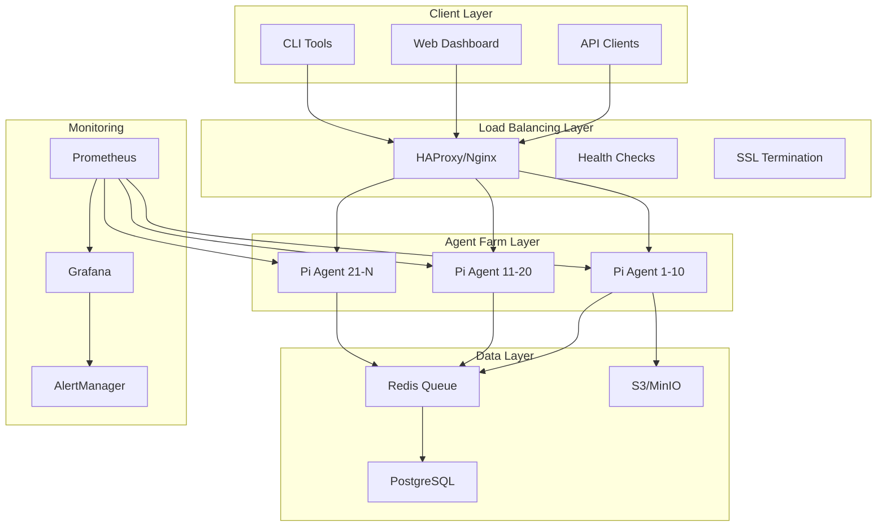

# 🏗️ Architecture: Designing Scalable Pi Agent Farms

#architecture #design #scalability #infrastructure

## System Architecture Overview



## 🎯 Core Components

### 1. Agent Nodes (Raspberry Pi)
Each Pi runs:
- **Chromium browser** (ARM64 optimized)
- **Node.js agent server** (REST API)
- **Python automation scripts**
- **Monitoring exporters**

### 2. Load Balancer
- **Distribution**: Round-robin, least-connections, or weighted
- **Health checks**: HTTP endpoints on each Pi
- **SSL termination**: Centralized HTTPS handling
- **Sticky sessions**: For stateful operations

### 3. Message Queue
- **Task distribution**: Redis or RabbitMQ
- **Priority queues**: Urgent vs batch tasks
- **Retry logic**: Failed task handling
- **Rate limiting**: Prevent overwhelming targets

### 4. Data Storage
- **Metadata**: PostgreSQL for structured data
- **Screenshots/Files**: S3-compatible storage (MinIO)
- **Cache**: Redis for temporary data
- **Logs**: Elasticsearch or Loki

## 📐 Network Architecture

### VLAN Segmentation
```
VLAN 10: Management Network
├── SSH access
├── Monitoring
└── Ansible control

VLAN 20: Agent Network  
├── Pi agents
├── Internal communication
└── Queue access

VLAN 30: Public Network
├── Load balancer
├── API endpoints
└── Internet access
```

### Network Diagram
```
Internet
    │
    ▼
[Firewall]
    │
    ├──[VLAN 30]── Load Balancer
    │                    │
    │                    ├──[VLAN 20]── Pi Agents
    │                    │
    └──[VLAN 10]── Management
```

## 🔧 Software Stack

### Base Image Configuration
```dockerfile
# Dockerfile.pi-agent
FROM raspios:bullseye-lite

# System dependencies
RUN apt-get update && apt-get install -y \
    chromium-browser \
    nodejs \
    npm \
    python3-pip \
    supervisor \
    prometheus-node-exporter

# Agent software
COPY agent-server /opt/agent
COPY browser-automation /opt/automation

# Supervisord config
COPY supervisord.conf /etc/supervisor/conf.d/

EXPOSE 3000 9100

CMD ["/usr/bin/supervisord"]
```

### Agent Server Architecture
```javascript
// agent-server/architecture.js
class AgentArchitecture {
  constructor() {
    this.components = {
      api: new RestAPI(),
      browser: new BrowserPool(),
      queue: new TaskQueue(),
      metrics: new MetricsCollector()
    };
  }
  
  async initialize() {
    // Browser pool with recycling
    this.browserPool = await BrowserPool.create({
      max: 5,
      min: 2,
      idleTimeoutMillis: 30000,
      evictionRunIntervalMillis: 60000
    });
    
    // Task queue consumer
    this.queue.on('task', async (task) => {
      const browser = await this.browserPool.acquire();
      try {
        await this.processTask(browser, task);
      } finally {
        this.browserPool.release(browser);
      }
    });
  }
}
```

## 🚀 Scaling Patterns

### Horizontal Scaling
```python
# scaling_manager.py
class ScalingManager:
    def __init__(self):
        self.min_agents = 5
        self.max_agents = 50
        self.scale_threshold = 0.8  # CPU usage
        
    def check_scaling_needed(self):
        avg_cpu = self.get_average_cpu_usage()
        
        if avg_cpu > self.scale_threshold:
            return self.scale_up()
        elif avg_cpu < self.scale_threshold * 0.5:
            return self.scale_down()
            
    def scale_up(self):
        # Power on standby Pis
        available = self.get_standby_agents()
        if available:
            self.activate_agent(available[0])
            return True
        return False
```

### Vertical Scaling Options
| Model | RAM | CPU | Use Case | Cost |
|-------|-----|-----|----------|------|
| Pi 4 4GB | 4GB | 4-core 1.5GHz | Light tasks | $55 |
| Pi 4 8GB | 8GB | 4-core 1.5GHz | Standard | $75 |
| Pi 5 4GB | 4GB | 4-core 2.4GHz | Fast tasks | $60 |
| Pi 5 8GB | 8GB | 4-core 2.4GHz | Heavy tasks | $80 |

### Geographic Distribution
```yaml
# geo-distribution.yml
regions:
  us-east:
    agents: [pi-us-east-01, pi-us-east-02]
    location: "New York"
    
  us-west:
    agents: [pi-us-west-01, pi-us-west-02]
    location: "Los Angeles"
    
  eu-central:
    agents: [pi-eu-01, pi-eu-02]
    location: "Frankfurt"
    
routing_rules:
  - domain: "*.com"
    preferred_region: "us-east"
  - domain: "*.eu"
    preferred_region: "eu-central"
```

## 🔒 Security Architecture

### Defense in Depth
```
Layer 1: Network Security
├── Firewall rules
├── VLAN isolation
├── VPN access only
└── DDoS protection

Layer 2: Host Security
├── Minimal OS install
├── Automatic updates
├── Fail2ban
└── AppArmor/SELinux

Layer 3: Application Security
├── API authentication
├── Rate limiting
├── Input validation
└── Audit logging

Layer 4: Data Security
├── Encryption at rest
├── TLS in transit
├── Key rotation
└── Access controls
```

### Security Implementation
```python
# security_layer.py
class SecurityLayer:
    def __init__(self):
        self.rate_limiter = RateLimiter()
        self.auth_manager = AuthManager()
        self.audit_logger = AuditLogger()
        
    def validate_request(self, request):
        # Authentication
        if not self.auth_manager.verify_token(request.token):
            raise UnauthorizedError()
            
        # Rate limiting
        if not self.rate_limiter.check(request.client_id):
            raise RateLimitError()
            
        # Input validation
        self.validate_input(request.data)
        
        # Audit logging
        self.audit_logger.log(request)
        
        return True
```

## 📊 Monitoring Architecture

### Metrics Collection
```yaml
# prometheus.yml
global:
  scrape_interval: 15s

scrape_configs:
  - job_name: 'pi-agents'
    static_configs:
      - targets: 
        - 'pi-agent-01:9100'
        - 'pi-agent-02:9100'
        
  - job_name: 'agent-api'
    static_configs:
      - targets:
        - 'pi-agent-01:3000'
        - 'pi-agent-02:3000'
```

### Key Metrics to Monitor
```javascript
// metrics.js
const metrics = {
  // System metrics
  cpu_usage: new Gauge('agent_cpu_usage_percent'),
  memory_usage: new Gauge('agent_memory_usage_bytes'),
  disk_usage: new Gauge('agent_disk_usage_percent'),
  
  // Application metrics
  active_browsers: new Gauge('agent_active_browsers'),
  tasks_processed: new Counter('agent_tasks_total'),
  task_duration: new Histogram('agent_task_duration_seconds'),
  
  // Business metrics
  pages_scraped: new Counter('pages_scraped_total'),
  screenshots_taken: new Counter('screenshots_total'),
  errors: new Counter('agent_errors_total')
};
```

## 🔄 High Availability

### Active-Active Configuration
```nginx
# nginx.conf
upstream pi_agents {
    least_conn;
    
    server pi-agent-01:3000 max_fails=3 fail_timeout=30s;
    server pi-agent-02:3000 max_fails=3 fail_timeout=30s;
    server pi-agent-03:3000 max_fails=3 fail_timeout=30s;
    
    # Backup agents
    server pi-agent-backup-01:3000 backup;
    server pi-agent-backup-02:3000 backup;
}
```

### Failover Strategy
```python
# failover_manager.py
class FailoverManager:
    def __init__(self):
        self.health_check_interval = 10
        self.max_retries = 3
        
    async def health_check(self, agent):
        try:
            response = await agent.get('/health')
            return response.status == 200
        except:
            return False
            
    async def handle_failure(self, failed_agent, task):
        # Remove from pool
        self.agent_pool.remove(failed_agent)
        
        # Redistribute tasks
        for _ in range(self.max_retries):
            alternate = self.get_healthy_agent()
            if alternate:
                return await alternate.execute(task)
                
        # Escalate if all retries fail
        self.alert_operator(failed_agent, task)
```

## 🎨 Design Patterns

### 1. Circuit Breaker
```python
class CircuitBreaker:
    def __init__(self, failure_threshold=5, timeout=60):
        self.failure_threshold = failure_threshold
        self.timeout = timeout
        self.failures = 0
        self.last_failure = None
        self.state = 'CLOSED'
        
    def call(self, func, *args, **kwargs):
        if self.state == 'OPEN':
            if time.time() - self.last_failure > self.timeout:
                self.state = 'HALF_OPEN'
            else:
                raise CircuitOpenError()
                
        try:
            result = func(*args, **kwargs)
            if self.state == 'HALF_OPEN':
                self.state = 'CLOSED'
                self.failures = 0
            return result
        except Exception as e:
            self.failures += 1
            self.last_failure = time.time()
            if self.failures >= self.failure_threshold:
                self.state = 'OPEN'
            raise e
```

### 2. Task Queue Pattern
```python
class TaskQueuePattern:
    def __init__(self, redis_url):
        self.redis = redis.from_url(redis_url)
        self.queues = {
            'high': 'tasks:high',
            'normal': 'tasks:normal',
            'low': 'tasks:low'
        }
        
    def enqueue(self, task, priority='normal'):
        self.redis.lpush(
            self.queues[priority],
            json.dumps(task)
        )
        
    def dequeue(self):
        # Check queues in priority order
        for priority in ['high', 'normal', 'low']:
            task = self.redis.rpop(self.queues[priority])
            if task:
                return json.loads(task)
        return None
```

### 3. Resource Pool Pattern
```javascript
class BrowserPool {
  constructor(options) {
    this.min = options.min || 2;
    this.max = options.max || 10;
    this.available = [];
    this.inUse = new Set();
  }
  
  async acquire() {
    // Return available browser
    if (this.available.length > 0) {
      const browser = this.available.pop();
      this.inUse.add(browser);
      return browser;
    }
    
    // Create new if under max
    if (this.inUse.size < this.max) {
      const browser = await this.createBrowser();
      this.inUse.add(browser);
      return browser;
    }
    
    // Wait for available browser
    return new Promise((resolve) => {
      const checkInterval = setInterval(() => {
        if (this.available.length > 0) {
          clearInterval(checkInterval);
          resolve(this.acquire());
        }
      }, 100);
    });
  }
  
  release(browser) {
    this.inUse.delete(browser);
    this.available.push(browser);
  }
}
```

## 🚦 Performance Optimization

### Browser Optimization
```javascript
// Optimized browser launch config
const browserConfig = {
  headless: true,
  args: [
    '--disable-gpu',
    '--disable-dev-shm-usage',
    '--disable-setuid-sandbox',
    '--no-sandbox',
    '--disable-web-security',
    '--disable-features=IsolateOrigins',
    '--disable-site-isolation-trials',
    '--disable-blink-features=AutomationControlled',
    // Memory optimization
    '--memory-pressure-off',
    '--js-flags=--max-old-space-size=512',
    // Performance
    '--disable-background-timer-throttling',
    '--disable-backgrounding-occluded-windows',
    '--disable-renderer-backgrounding'
  ]
};
```

### Caching Strategy
```python
# cache_layer.py
class CacheLayer:
    def __init__(self):
        self.redis = redis.Redis()
        self.ttl = {
            'screenshot': 3600,  # 1 hour
            'page_content': 300,  # 5 minutes
            'api_response': 60   # 1 minute
        }
        
    def get_or_fetch(self, key, fetch_func, cache_type='api_response'):
        # Check cache
        cached = self.redis.get(key)
        if cached:
            return json.loads(cached)
            
        # Fetch and cache
        result = fetch_func()
        self.redis.setex(
            key,
            self.ttl[cache_type],
            json.dumps(result)
        )
        return result
```

---

**Next**: [[Code-Examples]] - Implementation templates
**Related**: [[Implementation-Guide]] | [[Use-Cases]]