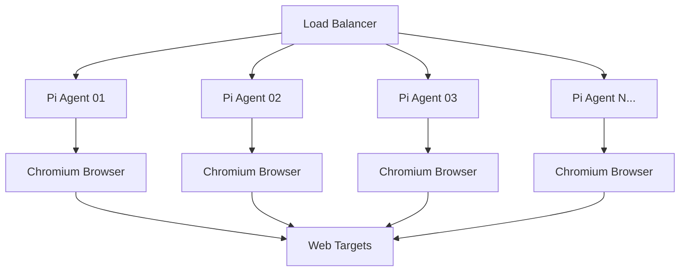

# 🌟 ARM64 Agent Farms Overview

#agent-farms #cost-savings #infrastructure #raspberry-pi

## What is an ARM64 Agent Farm?

An ARM64 Agent Farm is a distributed network of Raspberry Pi computers running Claude Code automation agents. Each Pi acts as an independent browser automation node, capable of:

- Web scraping at scale
- Automated testing across multiple browsers
- Continuous monitoring of websites
- Parallel content generation verification
- Distributed AI task execution

## 🔑 Key Advantages

### 1. **Massive Cost Reduction**
- **Hardware**: $130 per node (one-time)
- **Cloud equivalent**: $360/year per node
- **Break-even**: 4.3 months

### 2. **Power Efficiency**
| Metric | Pi Farm (10 nodes) | Cloud Equivalent |
|--------|-------------------|------------------|
| Power Draw | 150W | ~1500W |
| Annual kWh | 1,314 | 13,140 |
| Carbon Footprint | 90% lower | Baseline |

### 3. **Complete Control**
- No API rate limits
- No surprise bills
- No service shutdowns
- Custom modifications possible

### 4. **Linear Scalability**
```
1 Pi   = 1 agent   = $130
10 Pis = 10 agents = $1,300
100 Pis = 100 agents = $13,000
```

## 🏗️ Basic Architecture



## 📊 Typical Farm Configurations

### Starter Farm (3 nodes)
- **Cost**: $390
- **Use case**: Small agency, personal projects
- **Capacity**: 300 concurrent browser sessions
- **Power**: 45W (less than a light bulb)

### Business Farm (10 nodes)
- **Cost**: $1,300
- **Use case**: Growing SaaS, SEO agency
- **Capacity**: 1,000 concurrent sessions
- **Power**: 150W (less than a gaming PC)

### Enterprise Farm (50 nodes)
- **Cost**: $6,500
- **Use case**: Large-scale monitoring
- **Capacity**: 5,000 concurrent sessions
- **Power**: 750W (less than a space heater)

## 🎯 When to Use Agent Farms

### ✅ Perfect For:
- Continuous website monitoring
- Large-scale web scraping
- Distributed testing infrastructure
- SEO rank tracking
- Price monitoring
- Content verification
- Screenshot services

### ❌ Not Ideal For:
- Single-use scripts (use one Pi)
- CPU-intensive computing (use cloud)
- Large file storage (use NAS)

## 🚀 Getting Started

1. **Read**: [[Cost-Analysis]] to understand ROI
2. **Follow**: [[Implementation-Guide]] for setup
3. **Explore**: [[Use-Cases]] for inspiration
4. **Build**: [[Code-Examples]] for quick start

---

**Next**: [[Cost-Analysis]] - See detailed financial comparisons
**Related**: [[Architecture]] | [[Use-Cases]]